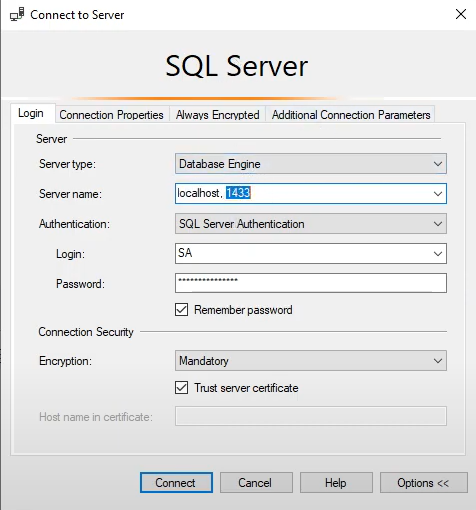

## REQUISITOS:
SLQ SERVER EXPRESS:
Para o banco poder funcionar, precisa instalar o [SQL EXPRESS](https://www.microsoft.com/pt-br/sql-server/sql-server-downloads)

DOCKER:
https://www.docker.com


## INICIAR O BANCO:
Para iniciar o banco primeiro de o comando para montar a imagem docker:

```sh
docker compose up
```

com o container montado e inicializado, abra o MYSQL Server e vá em connect e coloque as informações como consta na imagem abaixo, e assim como consta no arquivo:

Após conectado no servidor, no MYSQL , crie um novo banco de dados com o nome "teste";

Crie uma nova Query e cole todo o conteúdo do arquivo ScripTables.txt para poder criar as tabelas.


## MIGRAÇÃO PRISMA
com as tabelas criadas estará apto para fazer a migração do prisma, para isso dê o comando

```sh
npx prisma migrate dev
```

## VIDEO DE DEMONSTRAÇÃO E INSTALAÇÃO:
https://www.youtube.com/watch?v=z4wWsCrzt3w


# Backup e restore docker

Os scripts abaixo tem por finalidade auxiliar no backup e restore do volume utilizados em container docker:

## Backup
Para executar o backup utilize o comando abaixo substituindo <nome_do_volume> pelo nome do volume e <nome_do_target> pelo nome do caminho interno do volume:

```sh
docker run --rm --mount source=<nome_do_volume> ,target=<nome_do_target> -v .:/backup busybox tar -czvf /backup/backup.tar.gz <nome_do_target>
```
## Restore
Para executar o restore utilize o comando abaixo substituindo <nome_do_volume> pelo nome do volume e <nome_do_target> pelo nome do caminho interno do volume:

```sh
docker run --rm --mount source=<nome_do_volume>,target=<nome_do_target>-v .:/backup busybox tar -xzvf /backup/backup.tar.gz -C /
```


# Importante

Quando o container for enviado para a produção é de extrema importancia que a senha de conexão seja alterada e a variavel "MSSQL_PID" receba o valor de Express, pois essa é a versão gratuita do SQL SERVER.

